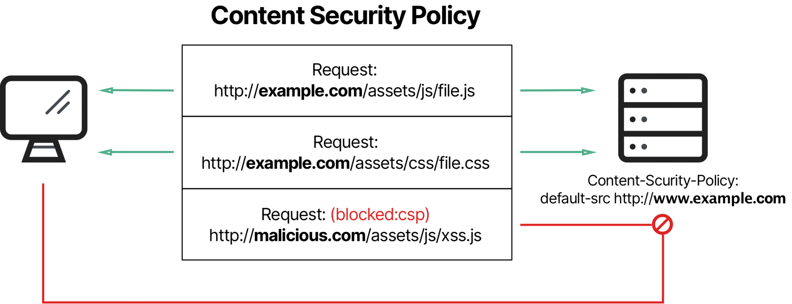
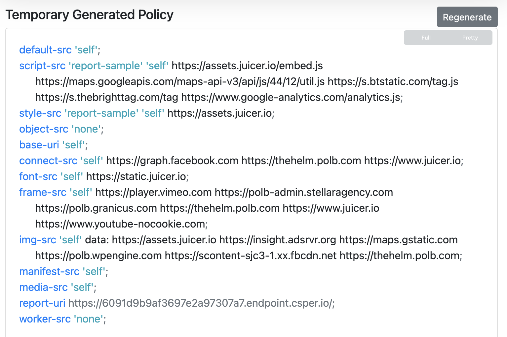
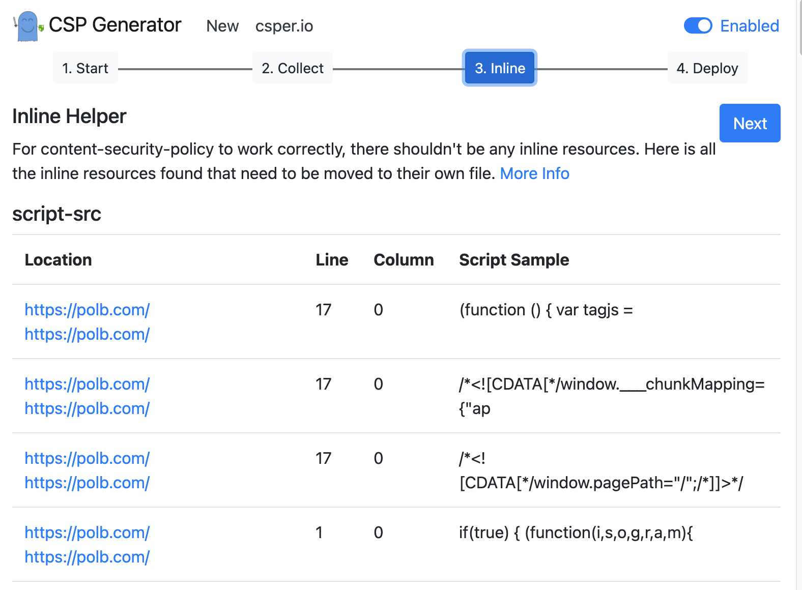

# What's a CSP? 
TLDR: Use [my Playwright script](https://github.com/deoxykev/quickcsp) to generate comprehensive CSP's quickly.

One of the mitigating defenses for [XSS attacks](https://portswigger.net/web-security/cross-site-scripting) and [Clickjacking attacks](https://portswigger.net/web-security/clickjacking) is a good Content Security Policy (CSP). While not a pancea, it can effectively limit the severity of any exploits by constraining the XSS payload size to the injection window, which is typically limited to a few characters. Instead of externally loading a payload like `<script src="https://evil.com/payload.js/>`, the entire payload must be encoded in the script evaluation window, effectively preventing nasty frameworks like [BeEF](https://beefproject.com/) from being loaded.



CSP's work by essentially "whitelisting" externally loaded content. If `evil.com` is not whitelisted for loading scripts, scripts from `evil.com` cannot be loaded into the site. Sounds great, right? Unfortunately, the reality is that CSPs are only [enforced on 7% of the Alexa Top 1M sites](https://www.rapid7.com/blog/post/2020/11/02/overview-of-content-security-policies-csp-on-the-web/). 

Why is this? If you've ever tried implementing a CSP on a non-trivial site, you'll know the number one difficulty is breaking the site by preventing legitimate content from being loaded-- oftentime on pages you never expected to have content on. It's no wonder top site owners are slow to implement CSPs.

Given an existing sites with tons of legacy content, how does one go about finding the specific external sources for each [CSP directive](https://developer.mozilla.org/en-US/docs/Web/HTTP/Headers/Content-Security-Policy)? One answer could be opening up devtools and browsing a few pages of the site, then writing it by hand. This might be fine for a single tiny site. But what if you have an entire company's worth of large sites to handle?

# Content Security Policy Generator (Chrome Extension)
Luckily for us, there is a chrome extension called [Content Security Policy (CSP) Generator](https://chrome.google.com/webstore/detail/content-security-policy-c/ahlnecfloencbkpfnpljbojmjkfgnmdc?hl=en) which will help us generate a CSP on all visited links. 

However, we still need to visit all the links. You could click them all manually, but that would also take you ages. Besides, don't you have more important things to do, such as sitting in meetings? Browser automation to the rescue!

# Playwright
I'll be using [Playwright](https://playwright.dev/), which is typically used to control a full browser via the Chrome DevTools protocol for QA testing purposes. It's a fork of [Puppeeteer](https://github.com/puppeteer/puppeteer). I prefer to use Playwright, due to it's more user-friendly [selector engine](https://playwright.dev/docs/1.0.0/selectors/). 

The advantage of using a full browser to crawl our site is that all dynamic content will be loaded. In this day and age, almost all sites are built using some javascript framework, which means a full browser is necessary to load all content for the Chrome extension to evaluate, leading to a more airtight CSP.

# Writing the script
## Downloading the chrome extension
Instead of downloading the [chrome extension](https://chrome.google.com/webstore/detail/content-security-policy-c/ahlnecfloencbkpfnpljbojmjkfgnmdc) by going to the web store, we will use curl to download the `.crx` source file. This is so we can load our plugin into playwright after we unzip it.

We will also use a free [CORS](https://developer.mozilla.org/en-US/docs/Web/HTTP/CORS) reverse proxy called [CORS Anywhere](https://github.com/Rob--W/cors-anywhere), in order to bypass the Chrome webstore's security policy. If we don't do this, the resulting response body will be empty.

```bash
extension_id="ahlnecfloencbkpfnpljbojmjkfgnmdc"

curl -s -L -o "./csper.zip" "https://cors-anywhere.herokuapp.com/https://clients2.google.com/service/update2/crx?response=redirect&os=win&arch=x86-64&os_arch=x86-64&nacl_arch=x86-64&prod=chromiumcrx&prodchannel=unknown&prodversion=9999.0.9999.0&acceptformat=crx2,crx3&x=id%3D${extension_id}%26uc" \
  -H 'Origin: https://robwu.nl'\
  -H 'Referer: https://robwu.nl/'\

unzip -d "csper-src" "csper.zip"
```

## Loading the CSPer extension into Playwright
Here, we provide some additional args to load the extension directory we just downloaded into Chrome. Note that we need to turn off headess mode for extensions to work.

```js
(async () => {
  const pathToExtension = require('path').join(__dirname, 'csper-src');
  const userDataDir = './user-data-dir';
  const browserContext = await chromium.launchPersistentContext(userDataDir,{
    headless: false,
    args: [
      `--disable-extensions-except=${pathToExtension}`,
      `--load-extension=${pathToExtension}`
    ]
  });

  // get url to load from command line 
  cspUrl = process.argv.slice(2)[0]

  const page = await browserContext.newPage();
  await page.goto(cspUrl)
})()
```

## Crawling each page recursively
In our playwright file, we define a function `crawl()` which will take a URL, scrape all `<a href=""/>` links off the page. This function uses another function called `waitForNetworkSettled()`, taken from this [gist](https://gist.github.com/dgozman/d1c46f966eb9854ee1fe24960b603b28). It's basically an alternative to `page.waitForNavigation({ waitUntil: "networkidle"}))`, which waits until the page loads. In my experience, the native function is buggy and resolves too early, so I had to use an alternative.

```js
  const seenURLs = new Set()
  const crawl = async (url) => {
	// don't recrawl pages alrady visited
    if (seenURLs.has(url)) {
      return
    }

	// only crawl pages that are within our base domain
    seenURLs.add(url)
    if (!url.startsWith(cspUrl)) {
      return
    }
    
	// don't crawl documents
    if (url.endsWith(".pdf") || url.endsWith(".docx") || url.endsWith(".xlsx")) {
        return
    }

	// define a request function that will wait until the page is loaded
	// will also scroll down to handle lazy-loaded items 
    const doRequest = waitForNetworkSettled(page, async () => {
        await page.goto(url, { waitutil: 'domcontentloaded' })
        await page.evaluate(() => window.scrollTo(0, (document.body.scrollHeight/3)));
    })

	// race the request function with a timeout function
	// this will allow page that don't stop loading assets to continue
    await Promise.race([
      doRequest, 
      new Promise((_, reject) => setTimeout(() => reject(new Error('timeout')), 11.5e3))
    ]).catch()

    try {
	  // scrape new URLS off the page 
      const urls = await page.$$eval('a', (elements) =>
          elements.map((el) => el.href),
      )

	  // recursively crawl them
      for await (const u of urls) {
          await crawl(u)
      }
    } catch {}
  }
```

# Generating our CSP

First, run the program.

```bash
node generate.js "https://polb.com"
```

When the browser loads, click on the extension icon and start a new recording.


Then, press enter to start recursively visiting all the URLs with the script.


Be mindful of being banned if there is an anti-bot service running on the site. Set a delay between page loads if necessary.

When it is done, generate your new CSP policy.



Don't forget to remove any inline scripts from your site.



## Deploying the CSP

Voila! you are done. Now go deploy your CSP by adding the `Content-Security-Policy: <your_generated_csp>` header to your site, if you have control over the server. If you have control over the content, but not the server, you can add this html tag `<meta http-equiv=”Content-Security-Policy” content=”<your_generated_csp>” />`.

Hopefully this saves you some time. [Source code here](https://github.com/deoxykev/quickcsp) if you'd like to use it.
